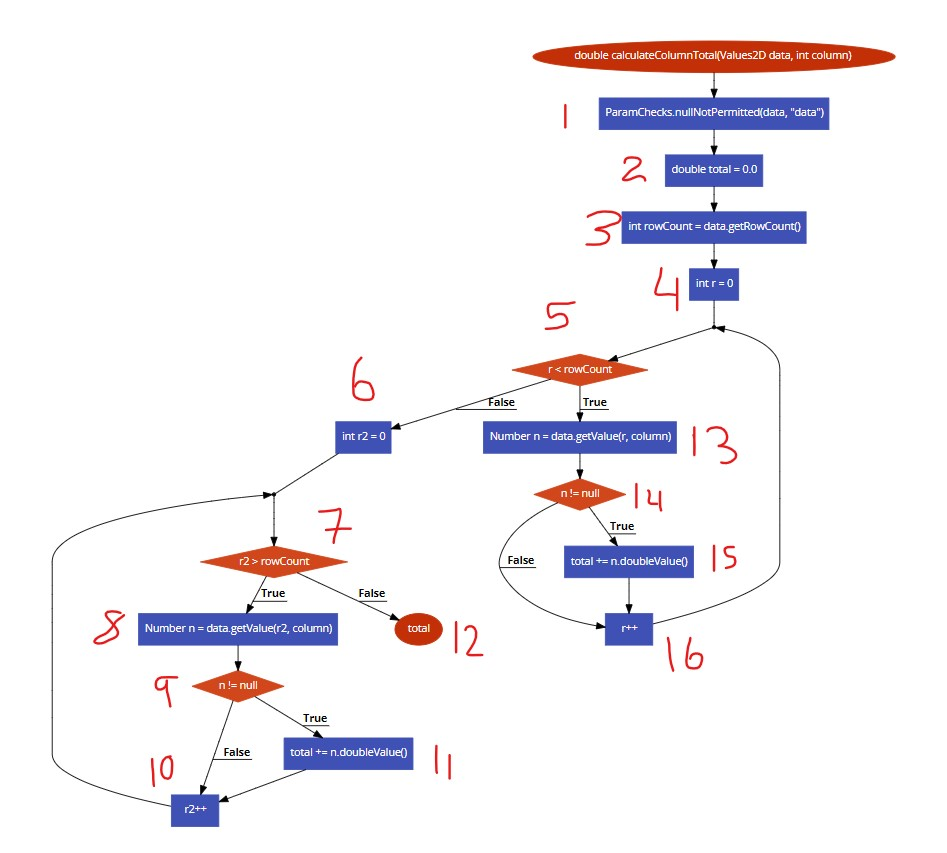
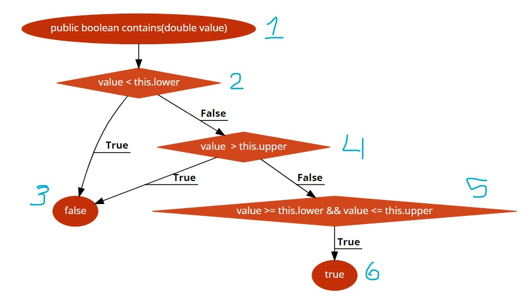
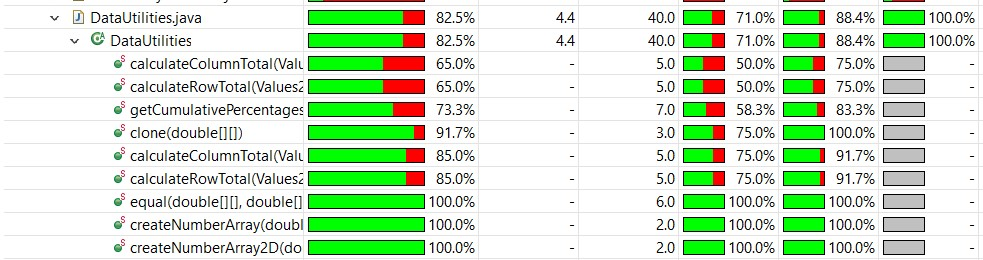
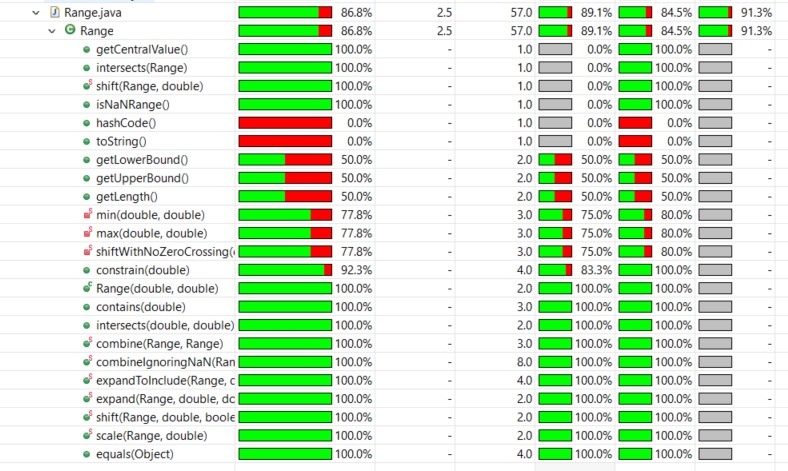

**SENG 438 - Software Testing, Reliability, and Quality**

**Lab. Report #3 – Code Coverage, Adequacy Criteria and Test Case Correlation**

| Group \#: 15          |     |
| --------------------- | --- |
| Student Names:        |     |
| Carlos Morera Pinilla |     |
| Neil Adrian Sarmiento |     |
| Hassan Anwar          |     |
| Toshi Biswas          |     |

(Note that some labs require individual reports while others require one report
for each group. Please see each lab document for details.)

# 1 Introduction

Extending from our Black Box test suite from the previous lab on the JFreeGraph SUT. We will now be creating test cases using various White Box
Techniques learned in class and depending on the class to test, employing various forms of coverage and attempting to improve the current code coverage from a exisiting test suite or creating a test suite for a class to get a certain threshold of coverage.

# 2 Manual data-flow coverage calculations for X and Y methods

CALCULATECOLUMNTOTAL MANUAL CALCULATIONS:

- Def Use Table: (Where node 1 will be )
  | Def | Use |
  | --------------------- | --- |
  | DEF(0) = {data, column} | USE(0) = Ø |
  | DEF(1) = Ø | USE(1) = {data} |
  | DEF(2) = {total} | USE(2) = Ø |
  | DEF(3) = {rowCount} | USE(3) = {data} |
  | DEF(4) = {r} | USE(4) = Ø |
  | DEF(5) = Ø | USE(5) = {r, rowCount}|
  | DEF(6) = {r2} | USE(6) = Ø |
  | DEF(7) = Ø | USE(7) = {r2, rowCount} |
  | DEF(8) = {n} | USE(8) = {data, r2, column}|
  | DEF(9) = Ø | USE(9) = {n}|
  | DEF(10) = Ø | USE(10) = {r2}|
  | DEF(11) = Ø | USE(11) = {total, n} |
  | DEF(12) = Ø | USE(12) = {total} |
  | DEF(13) = {n} | USE(13) = {data, r, column} |
  | DEF(14) = Ø | USE(14) = {n} |
  | DEF(15) = Ø| USE(15) = {total, n} |
  | DEF(16) = Ø | USE(16) = {r}|
- DU-Pairs for variables: (data, column, total, rowCount, r, r2, n) --> FORMAT: du(variable, defLine, useLine)

  - du(data, 0, 1) = {[0, 1]} --> du(data, 0, 3) = {[0, 1, 2, 3]}
    --> du(data, 0, 8) = {[0, 1, 2, 3, 4, 5, 6, 7, 8]} --> du(data, 0, 13) = {[0, 1, 2, 3, 4, 5, 13]}

  - du(column, 0, 8) = {[0, 1, 2, 3, 4, 5, 6, 7, 8]} --> du(column, 0, 13) = {[0, 1, 2, 3, 4, 5, 13]}

  - du(total, 2, 8) --> {[2, 3, 4, 5, 6, 7, 8]} --> du(total, 2, 11) --> {[2, 3, 4, 5, 6, 7, 8, 9, 11]} --> du(total, 2, 13) = {[2, 3, 4, 5, 13]} --> du(total, 2, 12) = {[2, 3, 4, 5, 6, 7, 12]}

  - du(rowCount, 3, 5) = {[3, 4, 5]} --> du(rowCount, 3, 7) = {[3, 4, 5, 6, 7]}

  - du(r, 4, 5) = {[4, 5]} --> du(r, 4, 16) = {[4, 5, 13, 14, 15, 16], [4, 5, 13, 14, 16]}

  - du(r2, 6, 7) = {[6, 7]} --> du(r2, 6, 10) = {[6, 7, 8, 9, 10]}

  - du(n, 8, 9) = {[8, 9]} --> du(n, 8, 11) = {[8, 9, 11]} --> du(n, 13, 14) = {[13, 14]} --> du(n, 13, 15) --> {[13, 14, 15]}

- TEST CASE COVERAGE DU PAIRS FOR COLUMNS:

  - testColumnSumValid(data, 0) = {(data, 0, 13), (column, 0, 13), (r, 4, 5), (r, 4, 13), (r, 4, 16), (r, 4, 12), (r2, 6, 7), (total, 2, 12), (total, 2, 15)}
  - testColumnSumInvalid(data, 0) = {(data, 0, 13), (column, 0, 13), (r, 4, 5), (r, 4, 13), (r, 4, 16), (r, 4, 12), (r2, 6, 7), (total, 2, 12), (total, 2, 15)}

  - DU-PAIR COVERAGE CALCULATION:
    testColumnSumValid() = testColumnSumInvalid() = 9/20 = 45%

RANGE.CONTAINS MANUAL CALCULATIONS:

- Control Flow Graph:
  

- DEF-USE TABLE:
  | Def | Use |
  | --------------------- | --- |
  | DEF(1) = {value} | USE(1) = Ø |
  | DEF(2) = Ø | USE(3) = {value} |
  | DEF(3) = Ø | USE(3) = Ø |
  | DEF(4) = Ø | USE(4) = {value} |
  | DEF(5) = Ø | USE(5) = {value} |
  | DEF(6) = Ø | USE(6) = Ø |

- DU-PAIRS for (value):

  - du(value, 1, 2) = {[1, 2]} --> du(value, 1, 4) = {[1, 2, 4]} --> du(value, 1, 5) = {[1, 2, 4, 5]}

- DU-PAIR COVERAGE FOR TEST CASES:
  - testContainLower(): {du(value, 1, 5)}
  - testContainUpper(): {du(value, 1, 5)}
  - testContainBLB(): {du(value, 1, 2)}
  - testContainAUB(): {du(value, 1, 4)}
  - testContainNom(): {du(value, 1, 5)}
    -DU-PAIR COVERAGE CALCULATIONS:
    33% (or 1/3 to be exact) for all possible test cases.

# 3 A detailed description of the testing strategy for the new unit test

Now that we have access to the source code, we will use that in combination with the Javadoc requirements of the JFreeChart SUT to improve our current standing test cases as well as design new test cases
based on methods we have not tested yet.

Based on our current tool, openClover we will cover Statement, Branch and Method Coverage(if a method has been executed at least once.)

Toshi will handle the method coverage to ensure we have more methods to test in the class.

Hassan will handle statement coverage to ensure most statement in each method are executed at least once.

Neil and Carlos will handle Branch Coverage to ensure most statements are covered. Via the rule of thumb: (Test Cases = Pred Nodes + 1)

# 4 A high level description of five selected test cases you have designed using coverage information, and how they have increased code coverage

Since Range was full of simple methods, in conjuction with the Control flow graphs of each method and the help of OpenClover, we managed to easily pick out quick methods to test each individual branch making sure it was tested at least once, thus vastly increasing branch and statement coverage.

We did the same with DataUtilities using our knowledge of White box techniques and the graph to weed out predicate nodes, so that we know roughly how many test cases to design for each method.

# 5 A detailed report of the coverage achieved of each class and method (a screen shot from the code cover results in green and red color would suffice)

## Order (Branch, Statement, Method)

DataUtilities.java Coverage of methods:

- 

Range.java Coverage of methods:

- 

# 6 Pros and Cons of coverage tools used and Metrics you report

For this assignment, we decided to use OpenClover because during the execution, it automatically gives the classes, three different metrics. Statement, Branch and Method coverage. Eclemma did not make clear which coverage metric it was calculating, as it only reports the coverage ratio as a whole average of every different metric.

Pros of OpenClover:

- Easy to test and sort metrics of classes.
- Much neater and easy to install.

Pros of Eclemma:

- Already included when you install Eclipse.
- Easy to run tests.

Cons of OpenClover:

- Not as intuitive to run tests, you need to select the project as a whole to test.

Cons of Eclemma:

- Does not report the various metrics, it was hard to find out what metrics were being tested.

# 7 A comparison on the advantages and disadvantages of requirements-based test generation and coverage-based test generation.

Advantages of Requirements-Based Testing:

- Much quicker way to test important functionality of methods in a class.
- Makes planning a test suite easier.
- Ensures quickly that requirements are correct, complete and logically consisent.
- Smaller Test Suite

Advantages of Coverage-Based Testing:

- Much more powerful in terms of testing logical execution of methods in a class.
- Better at tracking and finding bugs in a system that are more obscure.
- Due to more coverage of methods, it increases software quality indirectly.

# 8 A discussion on how the team work/effort was divided and managed

- Carlos - Report and Creating test cases to improve Coverage on Range
- Neil - Creating test cases to improve Coverage on DataUtilies
- Hassan - Report and adding statement coverage.
- Toshi - Report and adding some extra method coverage.

# 9 Any difficulties encountered, challenges overcome, and lessons learned from performing the lab

Getting the control flow coverage higher and getting used to making test cases based on DFG branches and predicate nodes.
As well as reading the Javadoc on a bunch of methods in the classes and having to look at the source code when the documentation was not clear.

# 10 Comments/feedback on the lab itself

Vague, hard to follow but useful for putting WBT techniques into practice.
